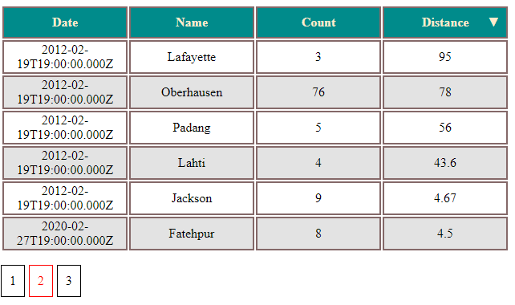

1. Создаем таблицу (*MySQL*) <br>
```sql
CREATE TABLE `table_for_test` (
  `id` int(11) NOT NULL AUTO_INCREMENT,
  `date` date DEFAULT NULL,
  `name` varchar(45) DEFAULT NULL,
  `count` int(11) DEFAULT NULL,
  `distance` decimal(10,2) DEFAULT NULL,
  PRIMARY KEY (`id`)
) ENGINE=InnoDB AUTO_INCREMENT=16 DEFAULT CHARSET=utf8mb4 COLLATE=utf8mb4_0900_ai_ci;

INSERT INTO `table_for_test` 
	VALUES (1,'2002-02-20','Bacolod',42,23.40),
		(2,'2012-02-20','Aachen',6,24.00),
		(3,'2020-11-30','Cabo Frio',8,23.43),
		(4,'2012-02-20','Dadu',6,23.00),
		(5,'2012-02-20','Xalapa',4,43.00),
		(6,'2012-02-20','Radom',43,22.00),
		(7,'2012-02-20','Padang',5,56.00),
		(8,'2012-02-20','Oberhausen',76,78.00),
		(9,'2012-02-20','Lafayette',3,95.00),
		(10,'2012-02-20','Lahti',4,43.60),
		(11,'2012-02-20','Jackson',9,4.67),
		(12,'2020-02-28','Fatehpur',8,4.50),
		(13,'1999-01-30','Habikino',6,7.70),
		(14,'1956-04-12','Jandira',4,32.00),
		(15,'1988-04-12','Moscow',23,32.40);
```

2. Редактируем файл "service_sql.js" <br>
```js
        const db = mysql.createPool({
            `host: 'localhost'`,//сервер
            `user: 'root'`,     //пользователь
            `password: 'pwd'`,  //Ваш пароль
            `database: 'test'`  //Название базы
        });
```
3. Запускаем установку зависимостей **$ npm install**<br>
4. Запускаем сервер **$ node service_sql.js**<br>
5. Открываем **index.html**<br>

